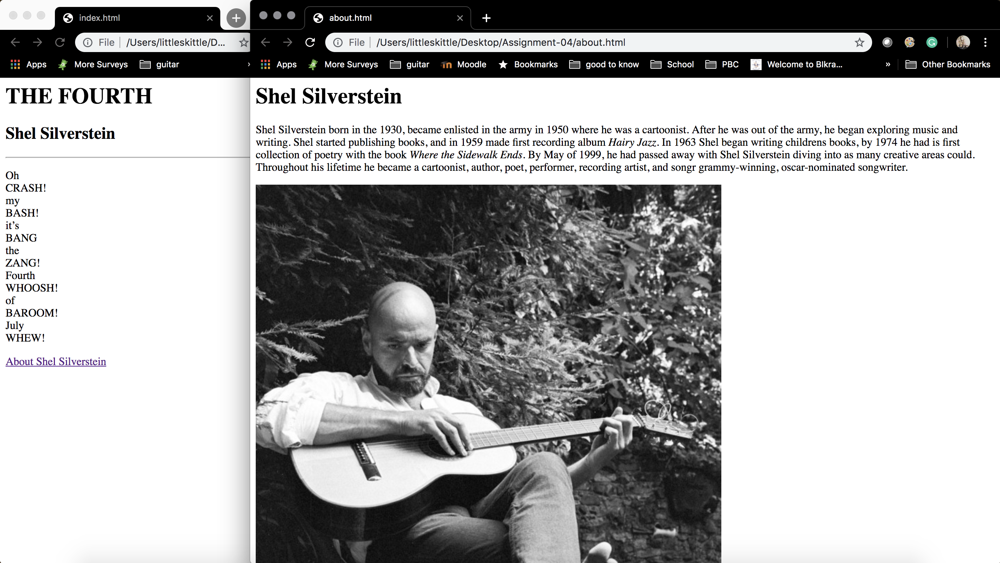

Using the wayback machine, I looked at the target website on June 27, 2004. The old website had options laid out on the lefthand side. The font was an older font for the options/menu navigation, where the font for the items was more clean looking. The search bar had an option to pick a store from Target, amazon.com, Mervyn's, or all of them; you could also enter a key word or item # underneath the store option. The main page was a navigation menu with options of where to go on the site. Today's target website had brighter colors, searching on only target, and the font was consistent. The menu navigation is at the top instead of the side, and the main page is more catalog style, showing the deals and items.  

In the GIT Module, I learned a basic understanding and variety of computer languages/terms. I learned how to use Atom and how to up upload from atom onto the GIT website. I think this module was fairly easy, few steps in the assignments were confusing and took a little time to figure out. But overall it was pretty simple.

