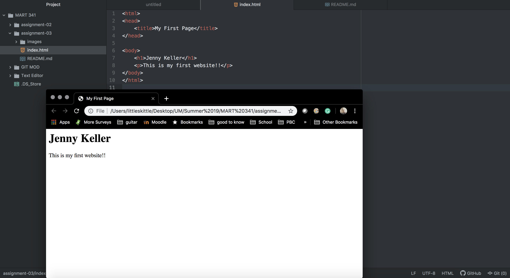

We send a request over the bowser through an interface with the browser engine. The browser uses a rendering engine to interprets components of information into a webpage showing graphics, images, text, and everything that makes up the website.
I currently and only really use google chrome as my browser.
Markup language is the architecture of the webpage by interpreting computer languages to define different elements with tags. HTML is Hypertext Markup language that is most commonly used, showing document nodes and is the most standard element and tagging system. HTML is used for creating webpages and formatting information, whereas a language like XML is used for storing structured data.

